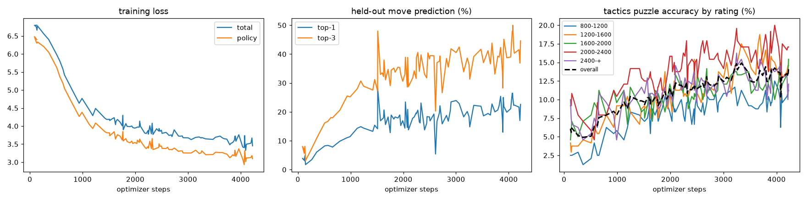

# blundernet

[](https://github.com/leozh0u/blundernet/actions/workflows/train.yml)
[](https://github.com/leozh0u/blundernet/actions/workflows/tests.yml)

A chess engine that trains itself. A small AlphaZero-style network learns
from fresh games by top Lichess blitz players, plays through Monte-Carlo
tree search with a C++ core, and measures its own strength against
Stockfish. The whole loop runs on a schedule with no human in it.



## What a scheduled run does

1. Pulls new rated blitz and rapid games from the current top-50 Lichess
   blitz leaderboard. Per-player cursors and game-id dedup guarantee no
   game is trained on twice.
2. Trains the network incrementally on the new positions.
3. Evaluates on data it never trained on: top-1/top-3 move prediction on a
   held-out slice, and a fixed suite of 1,200 Lichess tactics puzzles
   bucketed by rating (800-1200 through 2400+).
4. Commits the metrics and publishes the checkpoint as a rolling release,
   so the numbers in this README stay current and the model keeps
   improving across runs.

Once a day it also plays: a baseline gauntlet (random mover,
material-greedy) plus rated matches against Stockfish at fixed skill
levels, which anchor an Elo estimate over time
([metrics/stockfish_history.csv](metrics/stockfish_history.csv)), and two
self-play games whose search output feeds back into training.

## The model

18 input planes (piece positions, side to move, castling rights, en
passant file) into a 6-block residual CNN, 64 channels. Two heads: a policy
over 4096 from-square/to-square move indices and a tanh value head. Trained
with the standard AlphaZero supervised objective, cross-entropy on the
played move plus MSE on the game result.

2.57M parameters, and the split is lopsided: the residual trunk is 444k, the
value head 17k, and the remaining 2.1M is one dense layer projecting 512
features onto the 4096-move policy. Shrinking the network means attacking
that projection, not the trunk. Small enough either way that a run trains on
free CI hardware in about two minutes.

## Search

[mcts.py](src/blundernet/mcts.py) is a readable PUCT implementation.
[cpp/mctscore.cpp](cpp/mctscore.cpp) is the fast one: the tree lives in
flat C++ arrays behind a pybind11 API, and selection uses virtual loss so
each pass collects a batch of leaves that the network evaluates in a
single forward call. Batching is where the speedup comes from; batch-32
inference costs about 20x a single call for 32x the work. End to end the
C++ path searches about 1.8x faster at equal simulation counts, and the
two implementations agree on the top move in deep searches.

The C++ side knows nothing about chess and Python never touches tree
internals; the boundary is select_batch in, priors and values back.

One bug from the build is worth recording: node values are stored from
the node mover's perspective and the parent negates them when scoring, so
virtual loss has to be written as a child-perspective win to read as a
loss for the parent. With the sign wrong, every selection path
re-converged and the mean batch size was exactly 1.

## Self-play

[selfplay.py](scripts/selfplay.py) closes the reinforcement loop: the
engine plays itself with root Dirichlet noise and early-move temperature,
records each root's visit distribution, and trains the policy toward what
the search found rather than what a human played. At a few CPU games per
day this is a measured component, not the main strength driver; the
supervised stream does most of the lifting.

## Honest numbers

The engine is young. The first Stockfish anchor put it near 1000 Elo
after two days of scheduled training, and the strength benchmarks run
daily so the climb is recorded, not asserted. Current evaluation numbers
are in [metrics/latest.json](metrics/latest.json) and
[metrics/stockfish.json](metrics/stockfish.json).

## Run it locally

```bash
python -m venv .venv && source .venv/bin/activate
pip install -r requirements.txt --extra-index-url https://download.pytorch.org/whl/cpu
python cpp/setup.py build_ext --inplace   # optional: the C++ search core
python scripts/pipeline.py --no-commit    # one ingest/train/eval cycle
python scripts/bench_mcts.py              # Python vs C++ search benchmark
python scripts/gauntlet.py                # play the baseline ladder
python scripts/stockfish_bench.py         # needs stockfish on PATH
```

## Layout

```
src/blundernet/   encoding, model, data ingestion, training, evaluation, MCTS
cpp/              C++ tree core (pybind11)
scripts/          pipeline, benchmarks, gauntlet, self-play, puzzle-set builder
tests/            encoding, network shapes, search invariants, match bookkeeping
metrics/          history CSVs, latest results, training curves
data/             puzzle suite + ingest state
.github/          the scheduled training workflow and the test workflow
```

## Tests

```bash
pytest
```

The encoding is the contract between chess and the network, so most of the suite
guards it: plane layout, move-index round trips, and the legal mask against
python-chess. The rest covers network shapes and the parameter budget, search
invariants that hold at any weights (legal moves only, visit counts that add up,
finding mate in one from an untrained net), and the match and Elo arithmetic the
strength numbers are built on.

Design choices, tradeoffs, and the bugs worth remembering are in
[DECISIONS.md](DECISIONS.md).

## Roadmap

- [x] Continuous ingest/train/eval pipeline on scheduled CI
- [x] Tactics-puzzle suite bucketed by rating
- [x] PUCT MCTS, plus the C++ batched core
- [x] Baseline gauntlet and Stockfish-anchored Elo tracking
- [x] Self-play training loop
- [ ] Lichess bot account, so anyone can play it
- [ ] Elo-bucketed training: does a net trained on 1500s differ from one
      trained on 2800s?
